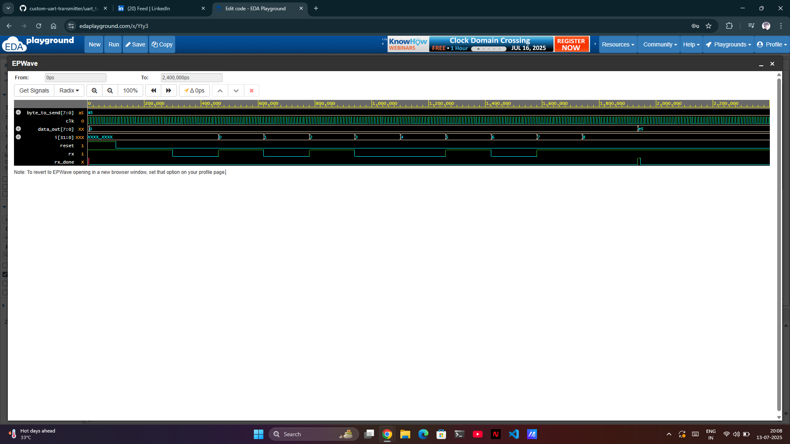

# UART Receiver (Verilog)

A simple UART Receiver designed using SystemVerilog, tested with Icarus Verilog.

---
=> Files

- `design.sv` – UART RX design
- `testbench.sv` – Testbench with pass/fail check
- `uart_rx_waveform.png` – Simulation waveform

---

=> Waveform Output

---

=> Simulation Result

